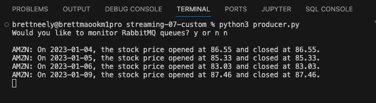
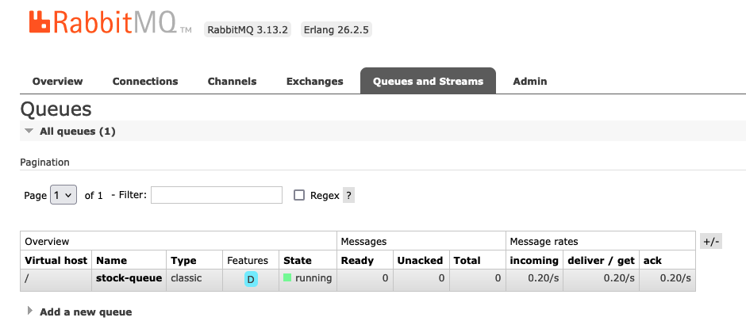
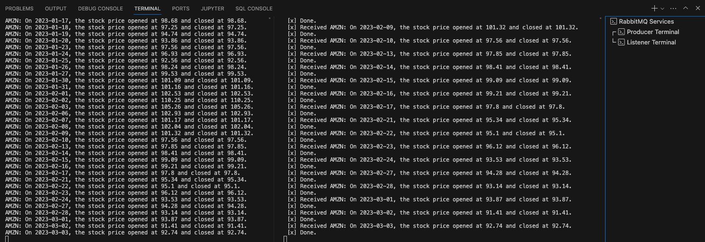

## streaming-07-custom

### Author: Brett Neely<br>Date: 6/9/2024</br>

### Objective:
> Use RabbitMQ to distribute tasks to a listener

Using yfinance (python librar) to grab stock data two Python processes will be created:
- One process will create task messages (daily open and close prices in this example).
- One process will listen for messages.

## RabbitMQ Admin 

RabbitMQ comes with an admin panel. When you run the task emitter, reply y to open it. 

(Python makes it easy to open a web page - see the code to learn how.)

## Prerequisites
RabbitMQ and pika must be installed

## Identify a stock to track
In the terminal, run stock_data.py program
```
python3 stock_data.py
```
This process can be customized and changed to identify a different stock to track.

Results are stored in a CSV file after running this program: ["stock_data.csv"](stock_data.csv)

## Start RabbitMQ in your terminal 
With Homebrew on Mac run this command in the terminal in the project:

``` 
brew services start rabbitmq
```

To stop RabbitMQ (once development / project is comlete):
``` 
brew services stop rabbitmq
```
## Execute the Producer
Run the producer of tasks Python file in the project terminal:
```
python3 producer.py
```

## Execute the Listener
Run the listening worker Python file in a new terminal (separate from the producer terminal)
```
python3 listener.py
```

## Screenshot of the messages in the terminal
These messages are sent to a queue:
> stock-queue



## Screenshot of separate queues in RabbitMQ Admin
After running the producer.py file the messages are sent to three separate queues as seen on RabbitMQ Admin:


## Screenshot of terminal setup

### For ease of use, open three terminals to run this project:
- One to run python3 producer.py (renamed as Producer Terminal in this screenshot) 
- Another to run python3 listening_worker.py (renamed as Listener Terminal in this screenshot)
- Another to start and stop RabbitMQ services with Brew (as mentioned above)

